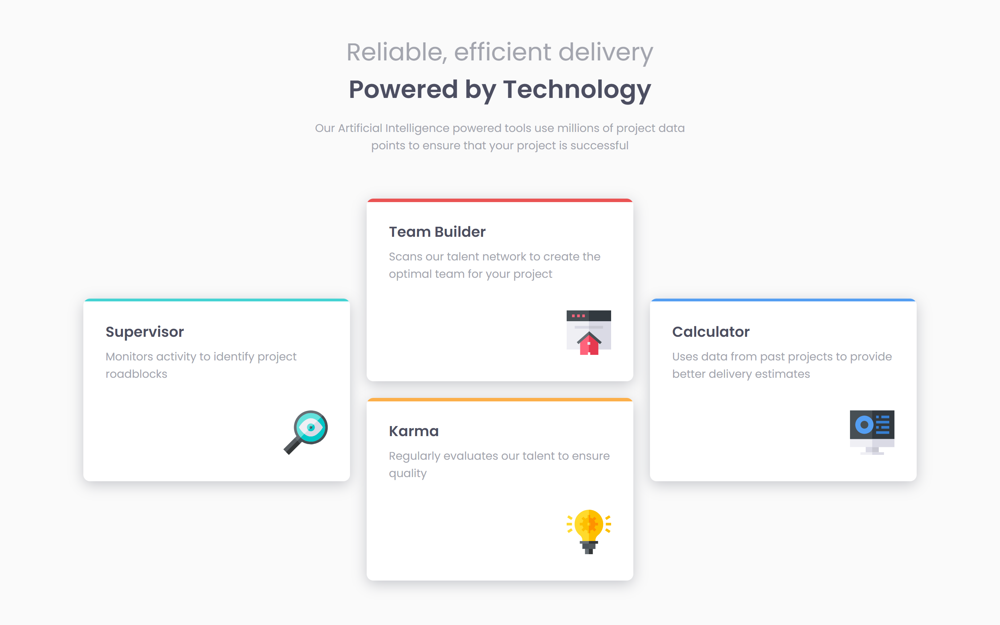

# Frontend Mentor - Four card feature section solution

This is a solution to the [Four card feature section challenge on Frontend Mentor](https://www.frontendmentor.io/challenges/four-card-feature-section-weK1eFYK). Frontend Mentor challenges help you improve your coding skills by building realistic projects. 

## Table of contents

- [Overview](#overview)
  - [The challenge](#the-challenge)
  - [Screenshot](#screenshot)
  - [Links](#links)
- [My process](#my-process)
  - [Built with](#built-with)
  - [Useful resources](#useful-resources)
- [Author](#author)

## Overview

### The challenge

Users should be able to:

- View the optimal layout for the site depending on their device's screen size

### Screenshot

### Links

- Solution URL: [https://github.com/Makson19/four-card-feature-section](https://github.com/Makson19/four-card-feature-section)
- Live Site URL: [https://makson19.github.io/four-card-feature-section/](https://makson19.github.io/four-card-feature-section/)

## My process

### Built with

- Semantic HTML5 markup
- CSS custom properties
- SASS
- Flexbox
- Mobile-first workflow

### Useful resources

- [SASS](https://sass-lang.com/documentation/syntax) - This helped me with some doubts I had about SASS.
- [Flexbox](https://css-tricks.com/snippets/css/a-guide-to-flexbox/) - This is an amazing article that helped me a lot to understand about the properties of flexbox. I recommend it to anyone who is still learning about it.

## Author

- Frontend Mentor - [@Makson19](https://www.frontendmentor.io/profile/Makson19)
- Github - [Makson19](https://github.com/Makson19)
- Codepen - [@Makson19](https://codepen.io/Makson19)

